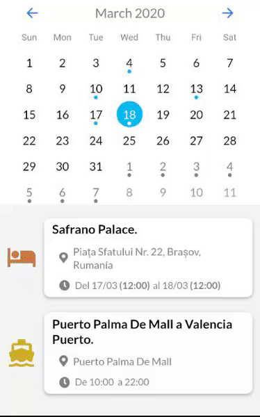

# Consultia Travel event agenda
This is an agenda made for the company Consultia Travel.

# Demo
At first I started doing it with React Native(my favourite framework) but later on we decided to continue with Ionic, so the React version of the app is not completly finished.

### App start
Ionic

### Calendar navigation
Ionic

React Native

### Event details
* **Different country recommendations**

Ionic

* **Additional information about the event**

* **Event details**

React Native

### Meteorology
Ionic

React Native

## Built With

* [Ionic](https://ionicframework.com/docs)
* [React Native](https://reactnative.dev/docs/getting-started)

## Authors

* **Aldimir Aleksandrov**
* **Álvaro Argüelles**

## Acknowledgments

* This was my first ever big project I worked in
* Done from scratch in one month without any knlowledge about Angular or Ionic in my internship as a student

